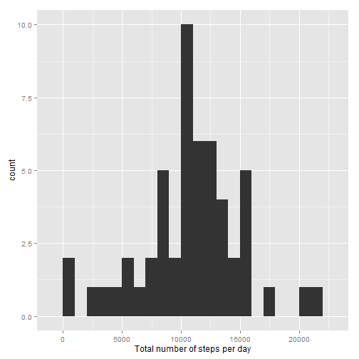
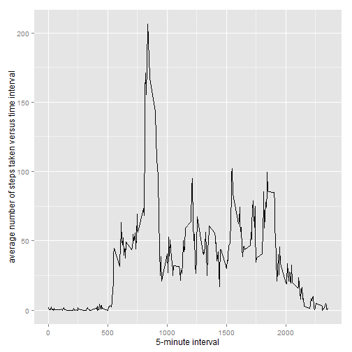
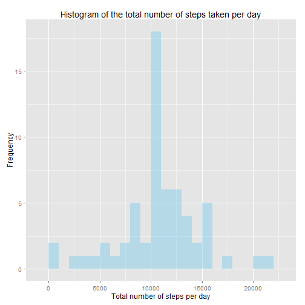

Reproducible Research: Peer Assessment 1
==========================================

### Loading and processing the data

```r
unzip(zipfile = "activity.zip")
```

```
## Warning in unzip(zipfile = "activity.zip"): error 1 in extracting from zip
## file
```

```r
dataNA <- read.csv("activity.csv")
dataNotNA <- na.omit(dataNA)
rownames(dataNotNA) <- 1:nrow(dataNotNA)
```


### What is mean total number of steps taken per day?

```r
library(ggplot2)
total <- tapply(dataNotNA$steps, dataNotNA$date, FUN = sum)
qplot(total, binwidth = 1000,  xlab = "Total number of steps per day")
```

 

Mean total number of steps taken per day:

```r
mean(total, na.rm = TRUE)
```

```
## [1] 10766.19
```
Median total number of steps taken per day:

```r
median(total, na.rm = TRUE)
```

```
## [1] 10765
```

### What is the average daily activity pattern?


```r
avg <- aggregate(dataNotNA$steps, list(interval = as.numeric(as.character(dataNotNA$interval))), FUN = "mean")
names(avg)[2] <- "meanStep"
ggplot(data = avg, aes(x = interval, y = meanStep)) + geom_line() + xlab("5-minute interval") + 
  ylab("average number of steps taken versus time interval")
```

 

* On average across all the days in the dataset, the 5-minute interval contains the maximum number of steps?

```r
avg[avg$meanStep == max(avg$meanStep), ]
```

```
##     interval meanStep
## 104      835 206.1698
```

### Imputing missing values
* Total number of rows with NAs:

```r
sum(is.na(dataNA))
```

```
## [1] 2304
```
* To impute values, we're going to use the number of steps taken per interval, averaged over all days:

```r
replacements <- aggregate(steps ~ interval, dataNA, mean, na.action = na.omit)$steps
newData <- transform(dataNA, steps = ifelse(is.na(dataNA$steps), replacements, dataNA$steps))
```
* How many NA values are in the new data?

```r
sum(is.na(newData))
```

```
## [1] 0
```
* Histogram of the total number of steps taken per day:

```r
totalStepsPerDay <- aggregate(steps ~ date, newData, sum)
ggplot(totalStepsPerDay, aes(x=steps)) +
  geom_histogram(alpha=0.5, fill="skyblue", binwidth=1000,position='identity') +
  ylab("Frequency") + xlab("Total number of steps per day") +
  ggtitle("Histogram of the total number of steps taken per day")
```

 


* Mean and median total number of steps taken per day:

```r
mean(totalStepsPerDay$steps)
```

```
## [1] 10766.19
```

```r
median(totalStepsPerDay$steps)
```

```
## [1] 10766.19
```


### Are there differences in activity patterns between weekdays and weekends?

* Create a new factor variable in the dataset with two levels -- "weekday" and "weekend" ( Note: Modify class type of new data "factor >> Date")


```r
newData$weekdays <- factor(format(as.Date(newData$date), "%A"))
levels(newData$weekdays)
```

```
## [1] "Friday"    "Monday"    "Saturday"  "Sunday"    "Thursday"  "Tuesday"  
## [7] "Wednesday"
```

```r
levels(newData$weekdays) <- list(weekday = c("Monday", "Tuesday", "Wednesday", "Thursday", "Friday"),
                                 weekend = c("Saturday", "Sunday"))
```

* Now, let's make a panel plot containing plots of average number of steps taken on weekdays and weekends.


```r
avgSteps <- aggregate(newData$steps, 
                      list(interval = as.numeric(as.character(newData$interval)), 
                           weekdays = newData$weekdays),
                      FUN = "mean")
names(avgSteps)[3] <- "meanOfSteps"
library(lattice)
xyplot(avgSteps$meanOfSteps ~ avgSteps$interval | avgSteps$weekdays, 
       layout = c(1, 2), type = "l", 
       xlab = "Interval", ylab = "Number of steps")
```

 
